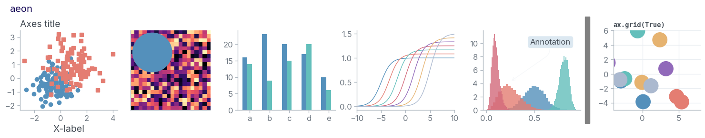
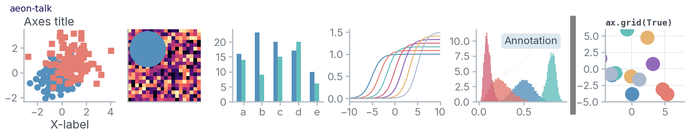

# A'eon's Matplotlib Styles

My personal matplotlib stylesheets. Data color palette by me, colors for text and background elements from [ayu](https://github.com/dempfi/ayu).

# Use

In your `.matplotlib` folder, make a folder called `stylelib` and save these `*.mplstyle` files in it.

# Examples

  
aeon

  

  
aeon-talk

  

  
aeon-dark

  

  
aeon-dark-talk

  

